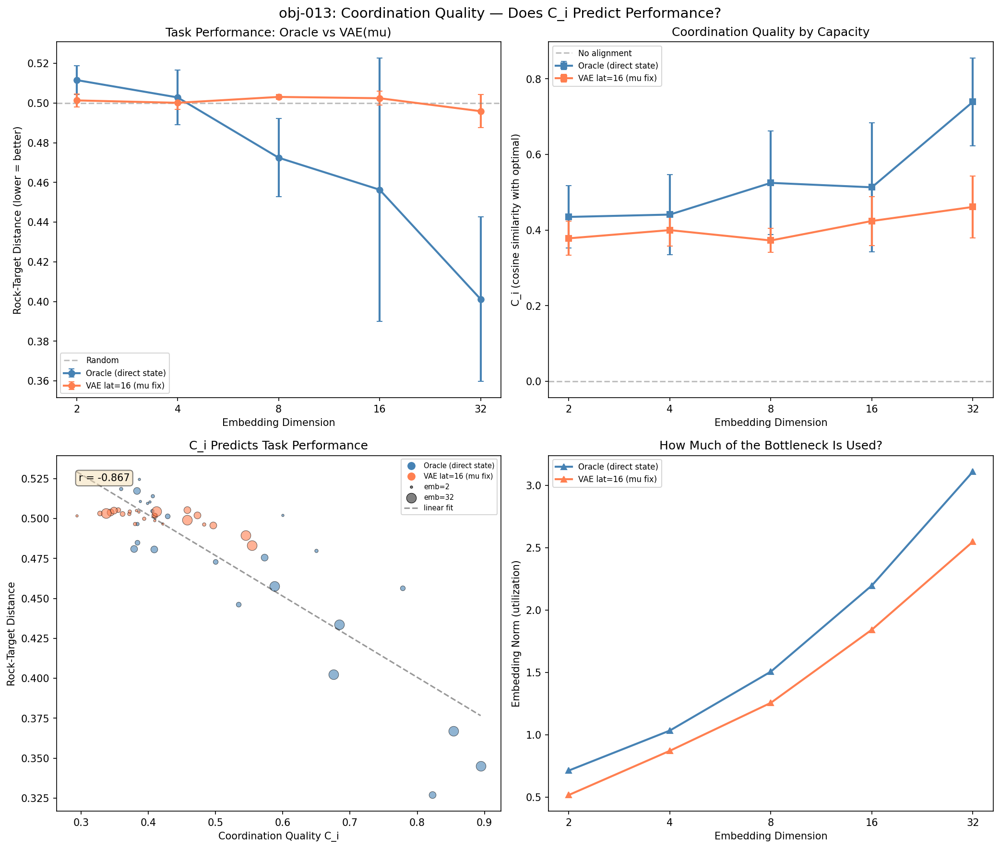

# WorldNN

**How much brain does an organism need to change the world?**

WorldNN is a simulation framework for studying information loss in perception-action loops. Physical objects are Mealy machines whose outputs pass through lossy channels, environmental encoding, and organism-specific sensorimotor filters. The central question: *what is the minimum internal capacity an agent needs to act effectively, as a function of cumulative information loss?*

## Key Result: Coordination Quality Predicts Learning (r = -0.87)

We introduce **coordination quality** C_i — the cosine alignment between an agent's learned action policy and the analytically optimal action — and show it predicts task performance with r = -0.87 across 50 independently controlled conditions.

A sharp threshold emerges:
- **C_i ≥ 0.6** → 100% learning success
- **C_i < 0.5** → 97% failure

Capacity and perception are **multiplicative**: you need both adequate perception AND sufficient embedding capacity to cross the C_i threshold. Neither alone suffices.



*Bottom-left: C_i vs task performance. Each point is one trained organism. Size = embedding dimension. Blue = oracle (direct state), orange = VAE perception.*

## Architecture

```
Matter (4D state) ──► Emission (8D) ──► Channel (noise) ──► Environment (VAE)
    ▲                                                             │
    │                                                          z or μ
    │                                                             ▼
    └──── Action ◄── Policy ◄── Embedding ◄── Sensory ◄── Organism
              (2D)         (bottleneck)
                        dim = 2,4,8,16,32
```

Each arrow is a lossy transformation. By the **data processing inequality**: I(S; E) ≤ I(S; z) ≤ I(S; Y) ≤ I(S; X). The organism must overcome all this information loss to act effectively.

### Independently Controlled Variables

| Variable | Range | Controls |
|----------|-------|---------|
| Perception mode | Oracle, raw emission, VAE (μ/z) | Information quality |
| env_latent_dim | 4, 8, 16, 32 | VAE compression |
| channel_noise | 0.01 – 0.5 | Signal corruption |
| embedding_dim | 2, 4, 8, 16, 32 | Organism capacity |

## The Rock-Push Task

The primary benchmark is a 2D rock-pushing task: the organism must navigate to a rock and push it to a target location. State is 4D [rock_x, rock_y, org_x, org_y], requiring spatial reasoning through the perception chain.

### Experimental Progression (13 objectives)

| Objective | Finding |
|-----------|---------|
| obj-001–005 | Binary flip task: too simple, capacity doesn't matter with PPO |
| obj-006–008 | Stochastic resonance debunked, predictive processing doesn't help simple tasks |
| obj-009 | Oracle baseline: capacity DOES matter for rock-push (emb=32: 0.306, emb=2: 0.501) |
| obj-010 | VAE kills all learning (0.502 everywhere) |
| obj-011 | Perception ladder: VAE lat=4 destroys spatial info (R²=0.044), lat=16 preserves it (R²=0.817) |
| obj-012 | Oracle vs VAE sweep: capacity gap +0.115 oracle, +0.001 VAE. Stochastic z is the culprit. |
| **obj-013** | **C_i predicts learning with r = -0.87. Sharp threshold at 0.5–0.6.** |

## Theoretical Framework: Sensory-Motor Alignment

Biological perception is not a data stream — it is a set of concurrent embeddings that must be *aligned* into a unified state representation via learned operators R_i (generalized rotations). Motor commands are projections of the aligned state.

**C_i operationalizes this**: it measures how well the full perception → embedding → policy pipeline aligns sensory input with task-relevant action directions.

This framework connects to:
- **Friston's Free Energy Principle** — C_i low ↔ high free energy
- **CCA / CLIP** — R_i operators are what alignment methods learn
- **Critical period neuroscience** — if C_i < ε for duration τ, the pathway prunes (the "blind cat" experiment)

See `tasks/research.md` for full formalization and prior art assessment.

## Project Structure

```
WorldNN/
├── src/worldnn/
│   ├── matter.py          # Mealy machines: binary flip + rock-push
│   ├── channels.py        # Noisy channel (fixed)
│   ├── environment.py     # VAE environment (learned compression)
│   ├── organism.py        # Sensory filter → embedding → policy
│   ├── world.py           # Full perception-action loop
│   └── train.py           # PPO training for all task types
├── experiments/           # One script per objective
├── paper/
│   └── draft.md           # Living arXiv paper draft
├── slurm/                 # PACE cluster job scripts
├── results/               # Generated figures and data
└── tasks/                 # Planning, research, lessons, objectives
```

## Quick Start

```bash
pip install -e ".[dev]"

# Run tests
pytest tests/ -v

# Run rock-push oracle baseline (GPU recommended)
python experiments/coordination_quality.py
```

GPU jobs should be submitted to PACE cluster (see `slurm/` for scripts).

## Related Projects

WorldNN is part of a three-project framework studying sensory-motor alignment:

| Project | What is R? | What is the channel? |
|---------|-----------|---------------------|
| **WorldNN** | Organism embedding layer | VAE + noise |
| **vaural** | Emitter MLP | ActionToSignal + Environment |
| **CorticalNN** | 3D growth topology | Sparse connectivity |

All three ask the same question: *how does an agent learn to act effectively through a lossy, unknown channel?*

## References

- Blakemore & Cooper (1970) — Stripe-reared kittens, critical period plasticity
- Friston (2010) — Free energy principle, active inference
- Tishby et al. (2000) — Information bottleneck method
- Radford et al. (2021) — CLIP, contrastive cross-modal alignment
- Vyas et al. (2020) — Rotational dynamics in motor cortex
