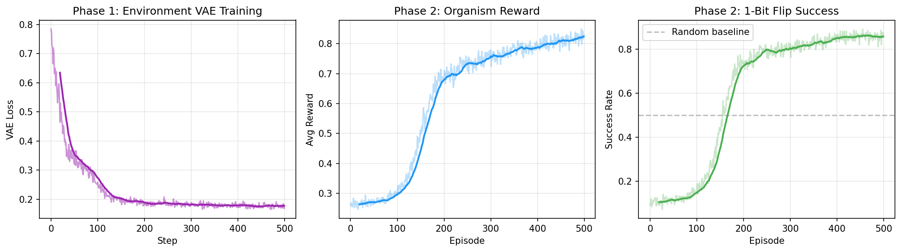
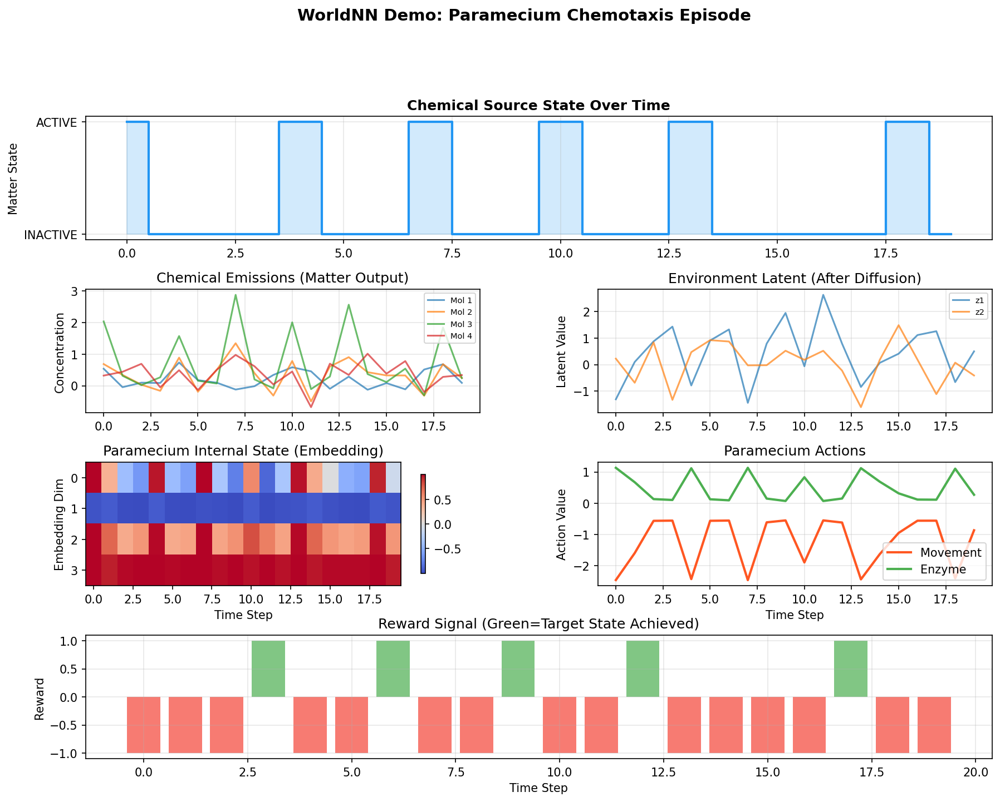
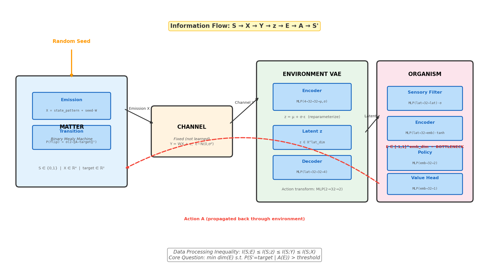
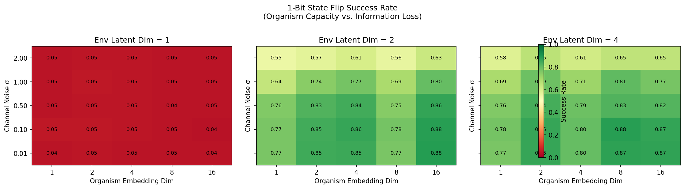
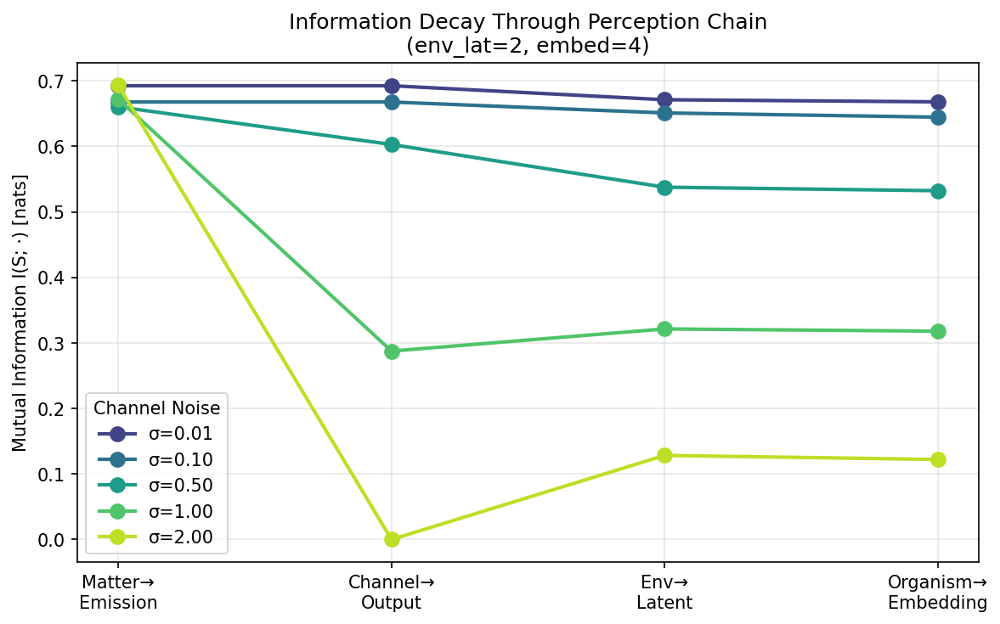
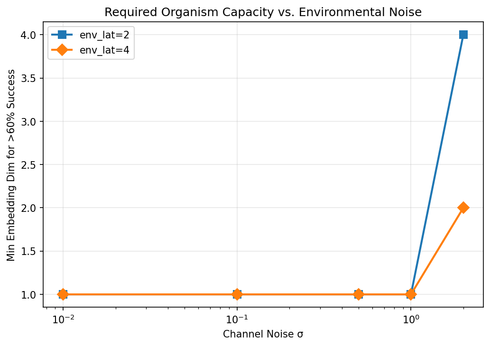
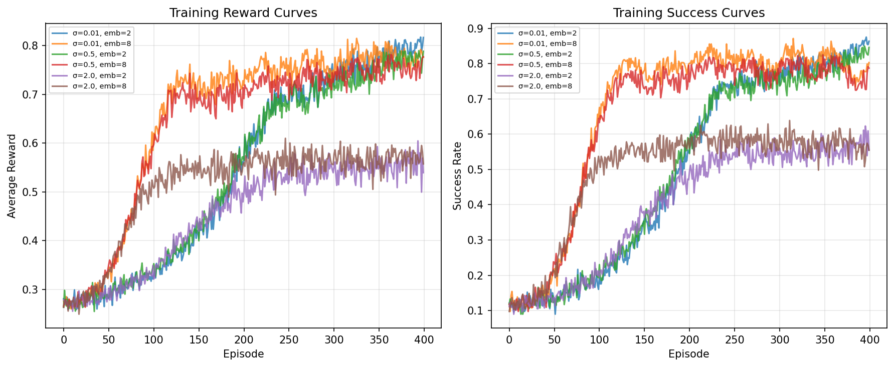

# WorldNN

**How much brain does an organism need to change the world?**

WorldNN is a simulation framework that studies information loss in perception-action loops. It models the complete chain from physical matter through environmental channels to organism perception and action, asking: *what is the minimum internal capacity an agent needs to reliably cause a 1-bit state change in the physical world, as a function of cumulative information loss?*

## Architecture

```
Random Seed
    │
    ▼
┌─────────┐   emission    ┌─────────┐   noisy      ┌─────────────┐   latent z   ┌───────────┐
│  MATTER  │─────────────▶│ CHANNEL  │──channel────▶│ ENVIRONMENT │────────────▶│ ORGANISM  │
│ (Mealy   │  X ∈ ℝ⁴      │ (fixed   │  Y ∈ ℝ⁴     │ (VAE)       │  z ∈ ℝᵈ     │           │
│  machine)│              │  noise)  │              │             │             │ Sensory → │
│          │◀─────────────│          │◀─────────────│             │◀────────────│ Embed →   │
│ S∈{0,1}  │    action     │          │   propagated │             │   action    │ Policy    │
└─────────┘    feedback    └─────────┘   action      └─────────────┘   A ∈ ℝ²    └───────────┘
```

Each arrow is a lossy transformation. By the **data processing inequality**:

```
I(S; E) ≤ I(S; z) ≤ I(S; Y) ≤ I(S; X)
```

The organism must overcome all this information loss to reliably flip the matter's binary state.

## Core Question

Given binary matter state S and a chain of lossy transformations, what is the **minimum embedding dimension** of the organism such that `P(S' = target | A(E)) > threshold`?

This is equivalent to asking: *how much internal model capacity does an agent need to act effectively, as a function of cumulative information loss in the perception-action loop?*

## Demo: Paramecium Chemotaxis

Our primary demo models a paramecium performing chemotaxis — detecting a chemical source's state through noisy diffusion and acting to change it.

| Component | Biological analog | Model |
|-----------|------------------|-------|
| Matter | Chemical source (active/inactive) | Binary Mealy machine with target action pattern |
| Channel | Chemical diffusion through medium | Linear transform + Gaussian noise |
| Environment | Aqueous medium (temp, viscosity) | VAE with tunable latent dimension |
| Organism | Paramecium (chemoreceptors + cilia) | Sensory filter → embedding bottleneck → policy MLP |

### Training Results

The organism learns to flip the chemical source to its target state through two training phases:

**Phase 1** — Environment VAE learns to compress channel signals (unsupervised).
**Phase 2** — Organism learns chemotaxis + enzyme deposition via REINFORCE.



The success rate rises from ~15% (random) to ~85%, demonstrating the organism learns to perceive and act through the noisy chain.

### Episode Visualization



Shows a single 20-step episode: matter state toggles, chemical emissions, environment latent encoding, organism internal state (embedding heatmap), and actions.

### Architecture Diagram



Detailed view of all ML blocks with dimensions. The **embedding bottleneck** (tanh-bounded, variable dimension) is the key parameter under study.

## Perturbation Study

The core experiment sweeps over three axes:

| Parameter | Values | Controls |
|-----------|--------|----------|
| Channel noise σ | 0.01, 0.1, 0.5, 1.0, 2.0 | Information loss in transmission |
| Environment latent dim | 1, 2, 4 | Compression in medium |
| Organism embedding dim | 1, 2, 4, 8, 16 | Brain capacity |

**75 configurations** total. For each, we measure:
- Success rate of 1-bit state flip (after training)
- Mutual information at each stage: I(S;X), I(S;Y), I(S;Z), I(S;E)
- Training convergence speed

### Results



**Three key findings from 75 configurations:**

1. **Environment compression is the dominant bottleneck.** `env_latent_dim=1` kills all learning (~5% success) regardless of organism capacity. The VAE cannot preserve state-discriminative information in a single dimension.

2. **Channel noise degrades gracefully.** Success drops from ~88% at σ=0.01 to ~63% at σ=2.0 for `env_lat≥2`. The organism adapts to noise rather than collapsing.

3. **Organism capacity has a nonlinear threshold.** At high noise (σ=2), `env_lat=2` requires `embed≥4` for >60% success, while `env_lat=4` only needs `embed≥2` — more environmental bandwidth compensates for less brain capacity.



The MI chain plot confirms the data processing inequality empirically: information about matter state monotonically decreases through the perception chain, with the sharpest drop at the channel stage for high noise.





## Project Structure

```
WorldNN/
├── src/worldnn/
│   ├── matter.py          # Binary Mealy machine (fixed physics)
│   ├── channels.py        # Noisy channel (fixed, not learned)
│   ├── environment.py     # VAE environment (learned compression)
│   ├── organism.py        # Sensory filter + embedding + policy
│   ├── world.py           # Full perception-action loop
│   ├── train.py           # Two-phase training (VAE + REINFORCE)
│   └── utils.py           # MI estimation (KSG estimator)
├── experiments/
│   ├── demo.py            # Paramecium chemotaxis demo
│   └── perturbation_study.py  # Full parameter sweep
├── tests/
│   └── test_components.py # 14 unit tests
├── results/               # Generated figures and data
└── tasks/                 # Project planning and research notes
```

## Quick Start

```bash
pip install -e ".[dev]"

# Run the demo (CPU, ~2 min)
CUDA_VISIBLE_DEVICES='' python experiments/demo.py

# Run the full perturbation study (CPU, ~30 min)
CUDA_VISIBLE_DEVICES='' python experiments/perturbation_study.py

# Run tests
pytest tests/ -v
```

## Current Progress

- [x] Core framework: Matter, Channel, Environment VAE, Organism
- [x] Full perception-action loop simulation
- [x] Two-phase training: VAE pre-training + REINFORCE
- [x] Paramecium chemotaxis demo (85.6% success rate)
- [x] Architecture visualization with ML block details
- [x] Unit tests (14 passing)
- [x] Perturbation study (75 configs, 3 sweep axes)
- [x] Mutual information chain analysis (KSG estimator)
- [x] Success heatmaps, MI decay plots, capacity curves
- [ ] Theoretical capacity bounds (analytical derivation)
- [ ] Predictive processing / world-model component
- [ ] Multi-object / continuous state scenarios

## Future Directions

- **Multi-object / multi-channel**: Scale beyond binary state to continuous state spaces with multiple matter objects
- **Predictive processing**: Add a world-model component where the organism predicts future observations and acts to minimize prediction error
- **NN-based matter**: Replace explicit physics with learned Mealy machine transitions for more complex matter dynamics
- **Rock-pushing scenario**: Organism must infer rock position via light, then apply force while sensing gravitational/friction feedback
- **Theoretical bounds**: Derive analytical relationship between channel capacity and minimum embedding dimension
- **Active inference**: Implement Friston's free energy minimization as an alternative training signal

## Theoretical Background

- **Mealy machines** — State-dependent I/O: output = f(state, input). Matter's emission depends on both hidden state and random seed.
- **VAEs** — Learned lossy compression with structured latent space. Natural fit for environmental medium effects.
- **Information bottleneck** (Tishby et al.) — Optimal tradeoff between compression and prediction.
- **Active inference** (Friston) — Free energy minimization as unifying principle for perception and action.
- **Rate-distortion theory** — Fundamental limits on lossy compression; sets theoretical floor for our empirical results.
- **POMDPs** — The organism's problem is a POMDP where the observation function is the full lossy chain.

## Inspirations

- Noah Goodman's Bayesian world models (world state as posterior over observables)
- Embodied cognition / sensorimotor contingency theory
- The hard problem of other minds: we can never directly observe matter's state, only its lossy projections
